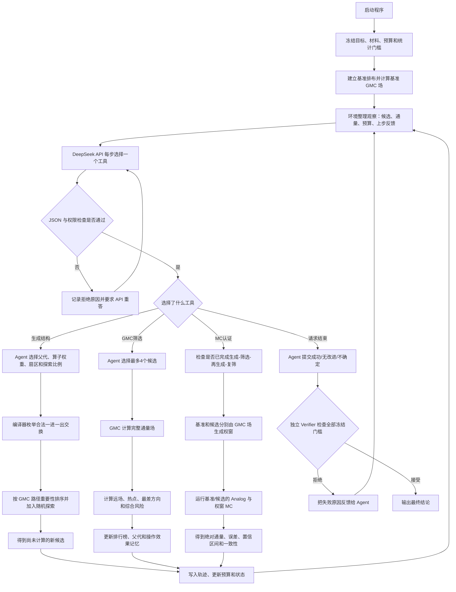

# GenShield-Agent 到底做了什么：零基础完整流程说明

这份说明不从“GMC、CVaR、权窗、Verifier”等术语开始，而是先回答一个最简单的问题：

> **程序启动以后，到结束以前，究竟是谁看到了什么、做了什么决定、运行了什么计算？**

配套流程图：

- 完整系统循环：`submission/assets/agent_workflow_plain.png`
- 封版运行 12 步轨迹：`submission/assets/agent_run_12_steps_plain.png`

正式证据口径采用：

`outputs/gmc_material_discovery/run_20260920_020815/`

---

# 1. 先用一个通俗比喻理解

可以把整个系统理解成一个“自动做实验的小组”，小组里有五个角色。

| 系统角色 | 通俗比喻 | 真正负责的事情 |
|---|---|---|
| DeepSeek API Agent | 实验负责人 | 根据现有结果决定下一步做什么 |
| 结构编译器 | 施工队兼安全员 | 把策略变成合法排布，保证不偷加材料、不移动源 |
| GMC | 快速体检设备 | 较快计算每个候选的完整通量场，指出哪里泄漏严重 |
| Monte Carlo | 昂贵的精密复查 | 对最终少数方案做粒子随机输运统计验证 |
| Verifier | 与 Agent 独立的裁判 | 检查所有冻结门槛，决定能否宣布成功 |

最重要的一点是：

> **Agent 不负责算物理，也不能直接画出任意几何；它负责决定下一次调用哪个工具、把有限计算预算花在哪里。**

---

# 2. 哪些东西在运行前就已经锁死

程序启动后，Agent 不能修改以下内容：

- 设计区域是 `7×7` 的材料格子；
- 粒子源固定在中心格 `(3,3)`；
- 强吸收材料始终只有 11 块；
- 每次修改必须是“移走一块、放入一块”，因此材料总量不变；
- 优化目标是降低远离源区域的通量；
- GMC 和 MC 的计算预算已经固定；
- MC 的历史数、重复数和网格下限已经固定；
- 最终统计检验阈值已经固定；
- Agent 不能修改 Verifier 的规则。

这意味着 Agent 不能通过以下方式“作弊”：

- 多放几块吸收材料；
- 把源移到更容易的位置；
- 看到结果不好后再修改评分指标；
- 看到统计检验失败后放宽阈值；
- 直接告诉程序某组坐标就是答案。

---

# 3. 程序启动时先做什么

运行命令启动后，程序依次完成以下准备。

## 3.1 读取配置

程序读取：

- 最大决策步数；
- 随机种子；
- GMC 网格与响应算子；
- 最大生成结构数；
- 最大 GMC 筛选数量；
- MC 总历史预算；
- Verifier 的全部统计门槛。

## 3.2 建立参考方案

程序先创建一套固定的初始排布，称为：

- **基准方案**；
- 英文记录中叫 `baseline`；
- 它的签名是 `ded6840cea70`。

签名只是排布坐标经过哈希后得到的短编号，便于日志引用，并不是物理量。

## 3.3 先计算基准 GMC 场

在 `gmc_only` 模式下，基准方案在 Agent 第一次决策前就已经具有 GMC 通量场。

因此 Agent 第一次看到的不是一张空白纸，而是：

- 当前基准材料排布；
- 基准完整通量场；
- 哪个方向泄漏最严重；
- 哪些空格可能值得放吸收块；
- 哪些已有吸收块可能作用较小；
- 当前全部计算预算。

## 3.4 建立四个可调用工具

当前主线中 Agent 可以选择：

1. `generate_structures`：生成候选结构；
2. `screen_gmc`：用 GMC 计算候选；
3. `certify_mc`：用 MC 精细验证候选；
4. `finish`：请求结束并提交结论。

程序每一步只允许 Agent 选择其中一个工具。

---

# 4. Agent 每一步实际收到什么

每一次决策前，环境会给 API 发送一份“实验状态摘要”。它主要包含：

## 4.1 当前科学目标

- 要降低源外远场通量；
- 同时关注远场热点和最严重泄漏方向；
- GMC 用于快速筛选；
- MC 用于最终统计验证。

## 4.2 不可改变的规则

- 网格大小；
- 源位置；
- 吸收块数量；
- 允许的几何操作；
- 验证门槛。

## 4.3 当前候选排行榜

环境只把最重要的一部分候选展示给 Agent，包括：

- 候选编号；
- 来自哪个父代；
- 做了什么材料移动；
- 是否已经经过 GMC；
- GMC 综合风险；
- 远场均值、热点和最差方向；
- 是否已经做过 MC。

## 4.4 当前物理诊断

对候选池中的优先父代，环境会提供：

- 最严重泄漏扇区；
- 8 个方向的相对泄漏强弱；
- GMC 路径重要性最高的空格；
- 当前作用相对较低的吸收块位置。

## 4.5 当前预算

例如：

- 还能生成多少结构；
- 还能 GMC 计算多少个候选；
- 每次最多能 GMC 计算几个；
- 还剩多少 MC 根历史。

## 4.6 上一步反馈

如果上一步失败，例如一次请求 6 个 GMC 候选、但每次上限只有 4 个，下一步 Agent 会明确看到：

> 上一次工具调用因为超过单次预算而被拒绝。

## 4.7 Verifier 的公开规则

Agent 在决策前知道成功需要满足哪些检查，但不能修改这些检查。

---

# 5. API 必须返回什么

API 不能返回一段随意的聊天文字，而必须返回一个结构化 JSON，核心有五项：

```json
{
  "tool": "本步选择的工具",
  "arguments": {"工具参数": "..."},
  "hypothesis": "本步要检验的科学假设",
  "expected_observation": "如果假设正确，预计看到什么",
  "decision_reason": "为什么此时最值得执行这一步"
}
```

例如，它可以说：

> 我选择从两个 GMC 表现最好的父代继续生成；提高“阻断泄漏路径”类操作的权重；因为它们已经比基准低约一个数量级，我预计下一代会进一步降低远场热点。

它不能说：

> 请直接把吸收块放在 `(3,4)`。

因为坐标由结构编译器根据物理场和合法操作生成，不由语言模型直接填写。

---

# 6. API 输出以后，程序先做协议检查

程序不会立即相信 API 输出，而是先检查：

- 是否为合法 JSON；
- 是否只选择了一个允许的工具；
- 工具参数是否完整；
- 是否包含可检验的假设；
- 是否写明预期观察；
- 是否写明决策理由；
- 是否试图输入坐标或修改受保护参数；
- 探索比例、批次数量等是否在允许范围内。

若输出不合规：

1. 本次响应被记为拒绝；
2. 错误原因反馈给 API；
3. API 在有限次数内重新回答；
4. 所有失败和重试都写入 `trajectory.jsonl`。

封版运行中一共有 17 次 API 交换，其中 5 次属于协议重试，最终形成 12 个被接受的科学决策。

---

# 7. 工具一：生成候选结构到底怎么做

工具名：`generate_structures`

这一阶段要特别区分“Agent 做的事”和“编译器做的事”。

## 7.1 Agent 只选择搜索策略

Agent 可以选择：

- 从哪些已经有 GMC 场的父代继续生成；
- 每个父代生成多少候选；
- 重点关注哪个泄漏方向；
- 哪种移动思路更重要；
- 多少比例按物理排名选，多少比例随机探索；
- 保留多少个优先父代。

Agent 不直接输出材料坐标。

## 7.2 编译器先把 GMC 场压缩为 `7×7` 诊断图

父代的 GMC 场原本是 `112×112`。程序把它聚合到材料宏网格，得到每一个宏格的：

- 相对通量；
- 与源的距离；
- 周围邻格的平均通量；
- 所属的角向扇区。

## 7.3 程序识别“泄漏路径重要性”

通俗地说，一个空格越符合以下条件，就越值得考虑放入吸收块：

- 当前通量高；
- 距离源较远，可能影响远场；
- 周围通量也高，说明不是孤立噪点，而可能处于连续泄漏路径；
- 位于当前最严重的泄漏方向。

当前 `gmc_only` 模式中的近似计算是：

```text
GMC 路径重要性
≈ 相对通量 × 距离权重 × 邻域路径连续性
```

它是物理启发式排序，不是严格的伴随灵敏度，也不是最终真值。

## 7.4 程序枚举所有合法的一进一出交换

一个父代有：

- 11 个可移走的吸收块；
- 37 个可放入的空格；
- 因此最多检查 `11×37=407` 种单步交换。

对每一种交换，程序都会估计：

- 被移走的吸收块当前是否有价值；
- 新位置是否处于高通量或关键泄漏路径；
- 是否修复某个方向的材料不足；
- 移动距离是否过大；
- 这种操作过去经过 GMC 后是否经常带来改善。

## 7.5 每个交换会得到一个“建议分”

建议分大致由以下因素组成：

```text
建议分
= Agent 对该类操作给出的权重
× 这种操作过去经过 GMC 后的效果
× 新位置需要程度
- 原位置作用价值
- 过远移动惩罚
```

## 7.6 利用与探索

假设一次需要生成 12 个候选，`exploration_fraction=0.20`：

- 约 10 个来自物理建议分最高的候选；
- 约 2 个从其余合法候选中随机抽取。

所以不同随机种子下，最前面的高分候选可能相同，但随机探索部分会不同。

## 7.7 生成不等于已经算过

`generate_structures` 只创建候选排布和谱系记录：

- 哪个父代产生；
- 移走哪里；
- 放入哪里；
- 使用什么操作类型；
- 建议分是多少。

这些候选此时还没有新的 GMC 场，必须经过 `screen_gmc` 才有物理结果。

---

# 8. 工具二：GMC 快速筛选到底做什么

工具名：`screen_gmc`

## 8.1 Agent 选择本批要计算的候选

Agent 从尚未计算 GMC 的候选中选择编号。

当前配置规定：

- 整个运行最多 GMC 筛选 16 个候选；
- 一次工具调用最多新增计算 4 个候选。

如果 Agent 一次请求 6 个或 12 个，环境会拒绝，而不是偷偷截断。

## 8.2 把 `7×7` 材料排布展开为 `112×112` 物理网格

每个宏格对应 `16×16` 个细网格。吸收块位置会被赋予较强吸收截面，背景位置使用背景材料参数，源仍位于中心。

## 8.3 GMC 求完整通量场

这里的 GMC 可以通俗理解为：

> 先用 GenVR/CFM 学会粒子经过一个局部单元时可能如何出射，再把所有单元的响应拼接起来，进行全局确定性组合求解。

因此它不是每次都从头追踪大量完整粒子历史，而是复用已经构建好的局部响应算子，输出完整二维通量场。

GMC 在本项目中的角色是：

- 比最终四组合 MC 认证更适合批量筛选；
- 给出比单一标量更丰富的完整空间场；
- 为下一轮结构生成指出泄漏路径；
- 为最终 MC 生成权窗。

但它仍是近似模型，不被当作最终物理真值。

## 8.4 从通量场提取六个指标

程序计算：

1. **远场平均通量**：远离源区域的平均值；
2. **远场 CVaR90**：远场中通量最高、最差的约 10% 网格的平均值；
3. **远场最大通量**：最严重的单点热点；
4. **最差扇区平均通量**：8 个方向中最严重方向的平均值；
5. **热点比**：最严重热点相对整体水平有多突出；
6. **角向不均衡**：不同方向的泄漏是否非常不均匀。

## 8.5 形成 GMC 综合风险

所有指标先除以基准方案对应指标，再按冻结权重加权：

```text
GMC risk =
    0.40 × 远场 CVaR90 相对值
  + 0.20 × 远场最大通量相对值
  + 0.15 × 远场平均通量相对值
  + 0.20 × 最差扇区平均通量相对值
  + 0.025 × 热点比相对值
  + 0.025 × 角向不均衡相对值
```

解释方式非常简单：

- 基准风险定义为 `1`；
- 候选风险 `<1`，表示 GMC 筛选结果优于基准；
- 风险越低，越值得进入下一轮；
- 这只是项目预先定义的筛选偏好，不是通用核工程标准。

## 8.6 GMC 结果会反过来影响下一代

GMC 计算完成后，程序会：

- 保存候选材料图和通量图；
- 保存原始 `NPZ` 场；
- 更新候选排行榜；
- 记录该候选来自哪种移动操作；
- 计算它相对父代改善了多少；
- 更新“哪种操作近期有效”的记忆；
- 把优胜候选作为下一轮可选择父代。

这一步就是所谓的：

> **物理证据反馈再生成。**

不是生成一次以后就结束，而是先测量，再根据测量结果生成下一代。

---

# 9. 为什么不能一开始就做 MC

程序设置了一个 MC 晋级门槛。只有至少完成以下证据链，Agent 才能调用 `certify_mc`：

- 已经 GMC 筛选至少 10 个非基准候选；
- 至少 4 个候选是“根据上一轮 GMC 场生成、随后又完成 GMC 复筛”的后代；
- 已经真正完成：

```text
生成
→ GMC 测量
→ 根据 GMC 结果再生成
→ GMC 再测量
```

- 被选候选的 GMC 风险小于 1；
- MC 预算足够完成冻结的最低精度。

这样可以防止 Agent 看到第一个稍好候选就立刻消耗全部昂贵 MC 预算。

---

# 10. 工具三：MC 精细认证到底做什么

工具名：`certify_mc`

## 10.1 Agent 选择冠军候选和计算资源

Agent 指定：

- 要认证哪个候选；
- 每个独立重复使用多少根历史；
- 重复多少次；
- MC 网格大小；
- 权窗参数。

封版运行选择：

- 候选 `d7d960548ee7`；
- `56×56` 网格；
- 每次重复 5,000 根历史；
- 4 个独立重复；
- 权窗通量指数 `0.9`。

## 10.2 基准和候选分别生成自己的 GMC 权窗

系统不会拿候选的 GMC 场去指导基准，也不会共用一张权窗。

它分别使用：

- 基准 GMC 场 → 基准权窗；
- 候选 GMC 场 → 候选权窗。

## 10.3 什么是权窗

权窗不是改变材料，也不是修改物理概率。它是告诉 MC：

> 在某个位置，粒子的权重大致应该处在什么范围。

程序先对 GMC 场做平滑和极低值截断，再使用近似倒通量重要性：

```text
重要性(x) ∝ GMC通量(x)^(-0.9)
目标粒子权重(x) ∝ GMC通量(x)^(0.9)
```

低通量、难到达的深穿透区域具有更高重要性和更低目标权重。

## 10.4 粒子过重就分裂，过轻就轮盘赌

- 粒子权重高于窗口上限：把一个粒子分裂成多个低权重粒子；
- 粒子权重低于窗口下限：执行俄罗斯轮盘赌；
- 被保留粒子的权重重新调整；
- 在期望意义上保持统计无偏。

目的不是让通量变小，而是让更多统计样本到达原本很难采样的远场区域。

## 10.5 实际运行四组计算

一次候选认证同时运行：

1. 基准 Analog MC；
2. 基准 GMC 权窗 MC；
3. 候选 Analog MC；
4. 候选 GMC 权窗 MC。

每组都是：

- 5,000 根历史/重复；
- 4 个重复；
- 共 20,000 根历史。

因此整个认证一次消耗：

```text
4组 × 5,000 × 4 = 80,000 根历史
```

这正好用完封版运行的全部 MC 根历史预算。

## 10.6 为什么既运行 Analog 又运行权窗

两者分工不同：

- **Analog MC**：不使用人口控制，是最直接的对照；
- **权窗 MC**：把更多样本输送到深穿透区域，提高统计精度。

如果权窗实现正确，两种方法对同一个设计的通量估计应在统计误差内一致。

因此权窗不是只负责给出一个更漂亮的图，它还必须接受 Analog 对照检查。

## 10.7 结构比较使用什么

程序使用基准和候选各自的权窗 MC 绝对远场通量进行结构比较，并报告：

- 候选/基准比；
- 估计下降比例；
- 两者差异的 z 值；
- 95% 置信区间是否分离；
- 深远场的诊断结果。

封版运行得到：

- 远场候选/基准 `0.109986`；
- 估计下降 `89.00%`；
- 差异 `z=-50.80`；
- 候选 95% 上界低于基准 95% 下界。

这是很强的候选信号，但仍不能直接宣布认证成功。

---

# 11. 工具四：请求结束以后谁说了算

工具名：`finish`

Agent 可以请求三种结论：

1. `verified_improvement`：已经验证候选更好；
2. `no_verified_improvement`：已经验证没有改进；
3. `inconclusive`：现有证据不足以下确定结论。

但是 Agent 的请求不等于最终结论。

独立 Verifier 会重新从环境中读取原始记录，检查：

- 候选是否真的不是基准；
- GMC 风险是否通过；
- 是否完成最低数量的 GMC 筛选；
- 是否真的发生 GMC 反馈再生成；
- MC 报告中的设计编号是否正确；
- 四组方法的历史数是否达到要求；
- 重复数和网格是否达到要求；
- 同一设计的 Analog 与权窗是否一致；
- 候选是否显著优于基准；
- 95% 区间是否分离。

只要一项硬门槛失败，`verified_improvement` 就不能通过。

---

# 12. 封版运行的 12 步到底发生了什么

下面不是理论流程，而是 `run_20260920_020815` 的真实执行顺序。

| 步骤 | Agent 选择 | 实际发生的事情 | 结果 |
|---:|---|---|---|
| 1 | 生成结构 | 从基准 GMC 场出发生成 12 个一进一出候选 | 成功 |
| 2 | GMC 筛选 | Agent 一次请求计算超过 4 个候选 | 被环境拒绝，没有偷偷计算 |
| 3 | GMC 筛选 | 改为计算建议分最高的 4 个候选 | 最佳风险降到 0.09842 |
| 4 | 再生成 | 选择两个最佳 GMC 父代，生成 16 个第二代结构 | 完成第一次 GMC 反馈再生成 |
| 5 | GMC 筛选 | 再次请求超过单次 4 个上限 | 被环境拒绝 |
| 6 | GMC 筛选 | 计算 4 个第二代候选 | 发现冠军 `d7d960548ee7`，风险 0.07593 |
| 7 | GMC 筛选 | 再计算 4 个第二代候选 | GMC 总筛选数达到 12，允许进入 MC |
| 8 | MC 认证 | 选择冠军，用基准/候选各自 GMC 权窗进行四组 MC | 得到 89% 远场下降强信号；80,000 MC 历史全部用完 |
| 9 | 再生成 | 从四个最佳父代继续生成 31 个候选 | 只能继续 GMC 路线，已无 MC 复验预算 |
| 10 | 请求成功 | Agent 请求宣布冠军已验证 | Verifier 因基准 Analog/权窗 `z=-2.1477` 拒绝 |
| 11 | GMC 筛选 | 使用剩余 GMC 预算计算 4 个备选候选 | GMC 总预算 16/16 用完；其中还有风险 1.09295 的失败候选 |
| 12 | 请求不确定 | Agent 承认没有预算完成新的 MC 认证 | Verifier 接受 `inconclusive`，运行结束 |

---

# 13. 为什么 89% 下降仍不能宣布成功

这不是说 89% 的下降信号不存在，而是说完整认证要求两层问题都通过。

## 第一层：候选与基准是否有明显差异

这一层通过了：

- 候选/基准约为 `0.10999`；
- 差异 `z=-50.80`；
- 95% 区间分离。

## 第二层：权窗 MC 自己是否与 Analog 对照一致

要求同一个设计中：

```text
|Analog 与权窗差异的 z 值| ≤ 2
```

结果：

- 候选：`z=0.8238`，通过；
- 基准：`z=-2.1477`，略微超过门槛，失败。

因此 Verifier 的判断是：

> 候选下降信号很强，但基准权窗估计与基准 Analog 估计之间仍有超出预设范围的偏离，不能把这一次有限历史结果升级为正式认证。

最终结论只能是：

- Agent 闭环确实完成；
- 候选改进是强信号；
- 最终物理认证仍为 `inconclusive`。

---

# 14. Agent 到底“智能”在哪里

## 14.1 它不是智能的部分

以下部分都是确定性程序或固定物理工具，不应归功于大模型：

- 检查几何是否合法；
- 枚举一进一出的材料交换；
- 计算 GMC 场；
- 运行 MC 粒子输运；
- 计算综合风险和统计量；
- 执行 Verifier 门槛；
- 写文件和绘图。

## 14.2 它真正负责的部分

Agent 的决策作用体现在：

- 选哪个父代继续生育下一代；
- 根据当前泄漏方向调整操作权重；
- 在物理高分候选和随机探索之间分配比例；
- 选哪些候选消耗有限 GMC 预算；
- 选哪个候选消耗昂贵 MC 预算；
- 遭到工具拒绝后如何修改请求；
- 遭到 Verifier 否决后继续搜索还是停止；
- 最终在证据不足时选择 `inconclusive`。

## 14.3 它并不完美

封版运行暴露了一个真实限制：

- 第 8 步的一次 MC 认证直接使用了全部 80,000 根历史；
- 第 10 步被 Verifier 否决后，已没有 MC 预算复验冠军或认证备选；
- 第 9、11 步虽然继续生成和 GMC 筛选，但这些新候选无法在同一次运行中完成最终 MC 认证。

所以准确的说法不是“Agent 已经做出了完美科研规划”，而是：

> **Agent 真实参与了一个受约束的闭环，并能响应证据和拒绝；但当前预算规划仍可改进。**

下一版最值得改的是把 MC 预算拆分成：

- 首次候选认证预算；
- 一致性复验预留预算；
- 备选候选认证预算。

---

# 15. 谁决定什么：最终对照表

| 问题 | 谁决定 |
|---|---|
| 科学目标是什么 | 人工在配置和代码中预先冻结 |
| 有多少材料 | 人工预先冻结 |
| 哪些结构修改合法 | 结构编译器 |
| 下一步调用哪个工具 | API Agent |
| 从哪些父代继续生成 | API Agent |
| 操作权重和探索比例 | API Agent |
| 具体移动哪个方块 | 物理引导结构编译器 |
| 候选通量场是多少 | GMC 求解器 |
| GMC 筛选分是多少 | 固定指标程序 |
| 哪个候选进入 MC | API Agent |
| 权窗具体数值是多少 | GMC 场和固定权窗算法 |
| MC 粒子如何输运 | MC 内核 |
| 是否允许宣布成功 | 独立 Verifier |

---

# 16. 一张可编辑的 Mermaid 流程图



---

# 17. 路演时最通俗的 40 秒讲法

> 我们的 Agent 像一个实验负责人，而不是物理求解器。每一步，它先看到当前最好的排布、GMC 通量场、剩余预算和上一步结果，然后只能选择一个工具：生成结构、做 GMC 筛选、做 MC 精算或请求结束。它不能直接填材料坐标；程序会根据 GMC 指出的高通量泄漏路径，枚举所有合法的一进一出材料交换。新结构先经过 GMC 快速体检，结果再反馈给 Agent 选择下一代。满足最低探索证据后，冠军才进入 Monte Carlo，并由自己的 GMC 场生成权窗。最后独立 Verifier 检查统计门槛。本次候选显示 89% 的下降信号，但一致性有一项略微失败，所以系统没有宣布成功，而是诚实输出不确定。

