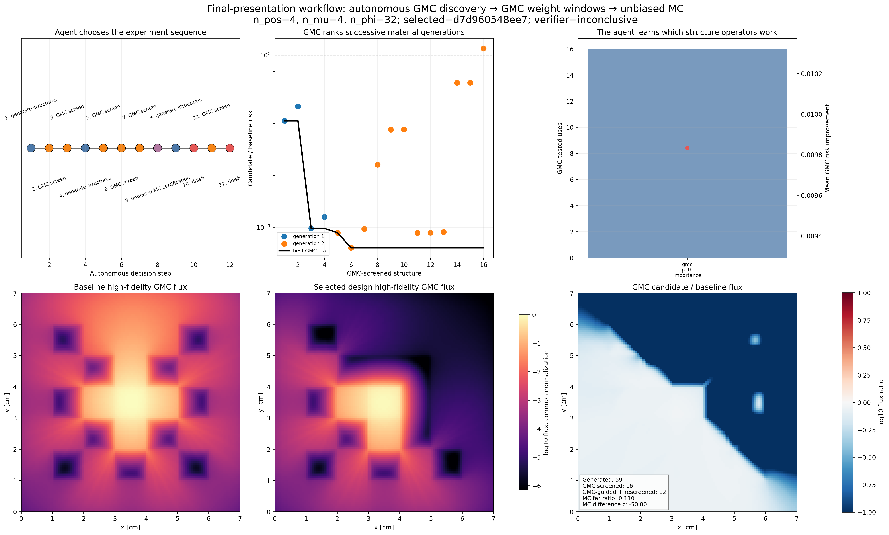
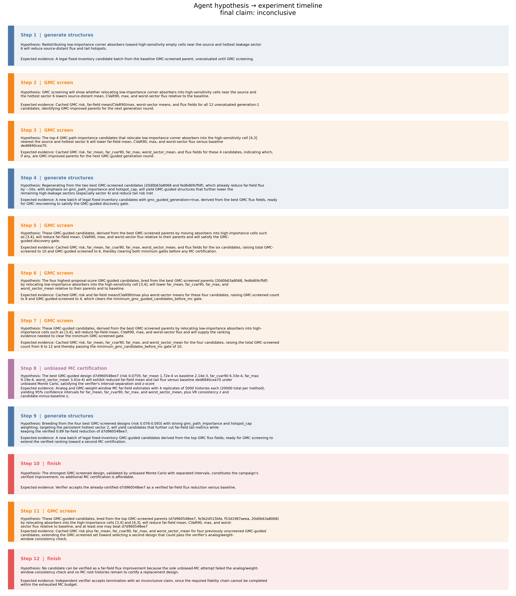
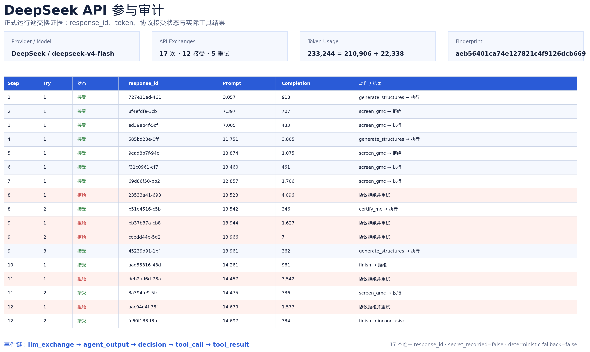
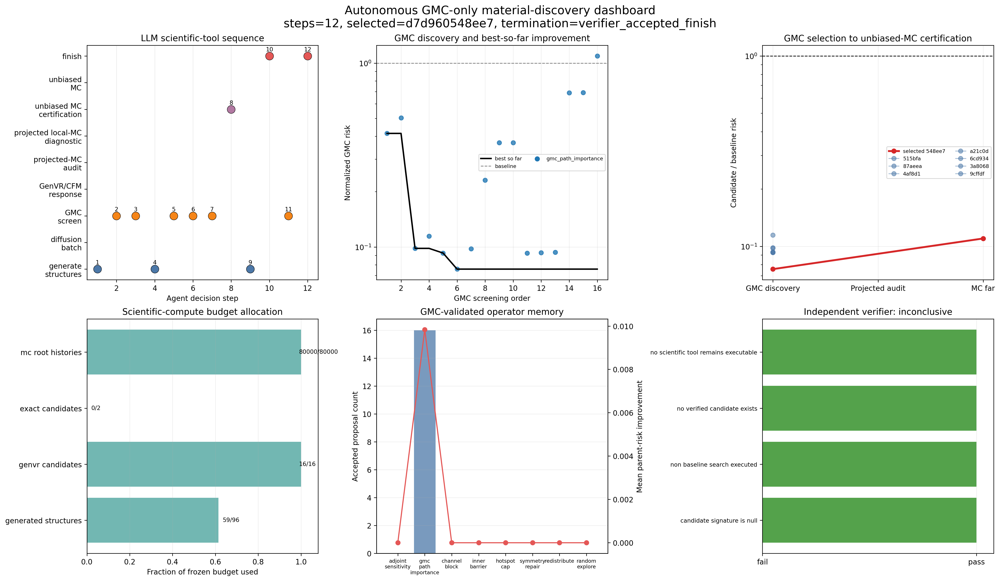
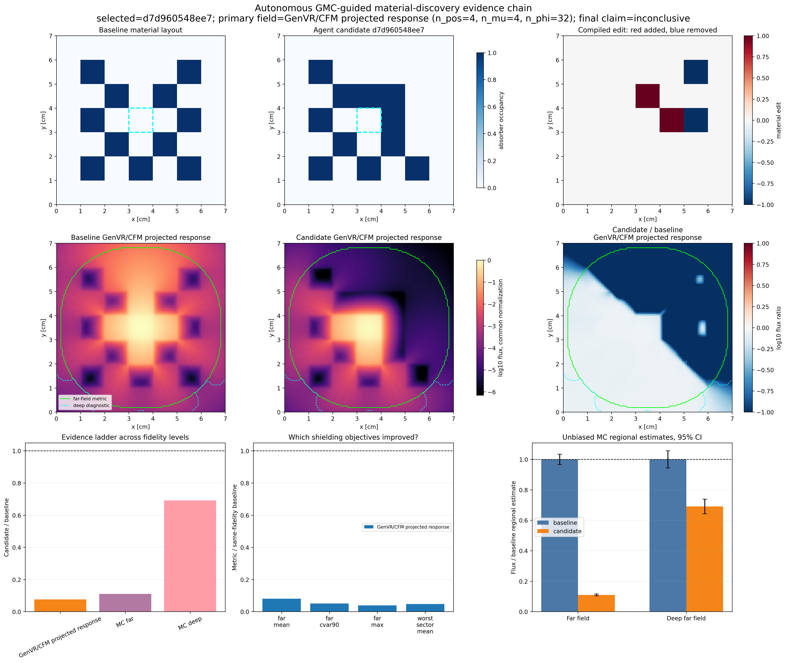
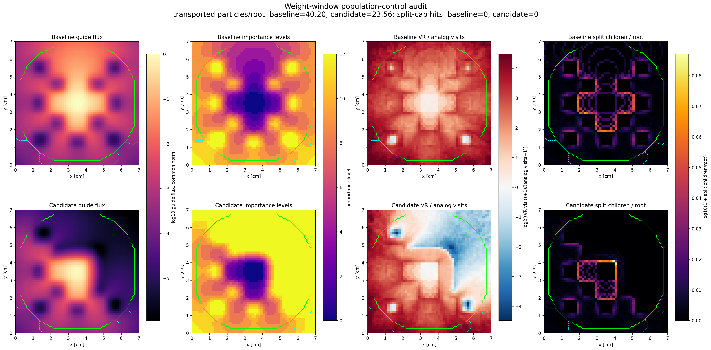
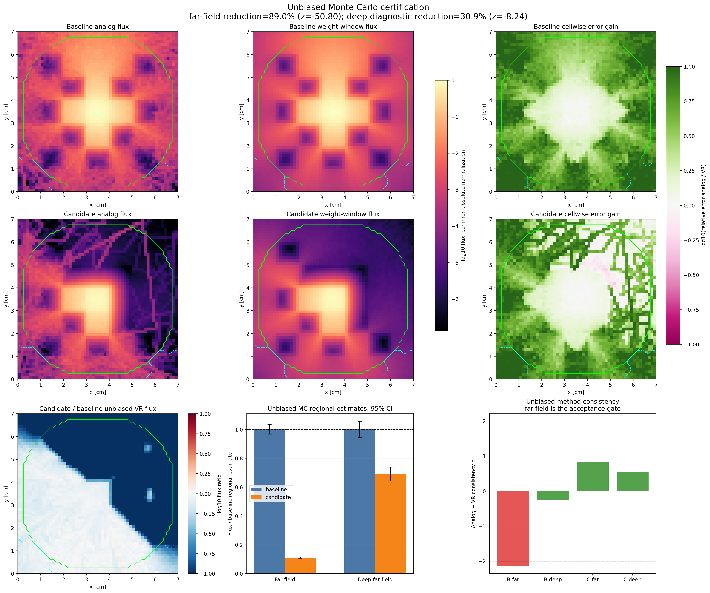

# 执行摘要

本项目不再把“射线效应是否明显”作为 Agent 的优化目标。本次大版本更新聚焦一个更直接、也更适合生成式智能体的问题：在固定材料预算下，Agent 能否像材料发现系统一样，自主产生屏蔽排布，利用较高分辨率 GMC 快速读取完整通量场，以物理证据改变下一代结构，再把冠军候选的 GMC 场转化为候选专属权窗，交给无偏 Monte Carlo（MC）作最终认证。

> **核心科学主张（Scientific Claim）**：在冻结的二维屏蔽 benchmark 中，GMC 通量场可以同时充当高通量结构评价证据和候选专属 MC 权窗引导，由此构成可审计的“提出—测量—再生成—认证”自主发现闭环。正式运行发现候选 `d7d960548ee7` 的权窗 MC 远场通量相对基准估计下降 `89.00%`，但基准 Analog/权窗一致性 `z=-2.1477` 超过预先冻结的 `|z|≤2.0` 门槛，因此独立 Verifier 拒绝“已验证改进”，最终物理结论保持 `inconclusive`。

| 维度 | 正式运行结果 | 结论等级 |
|---|---:|---|
| API 自主决策 | 12 步决策，17 次真实 API 交换，233,244 tokens | 已审计成立 |
| 结构发现闭环 | 59 个生成结构，16 个 GMC 筛选，12 个 GMC 引导后代完成复筛 | 已实现 |
| GMC 候选信号 | 最佳综合风险 0.07593；GMC 远场均值约降 91.95% | 强筛选信号 |
| MC 候选信号 | 远场候选/基准 0.10999，差异 z=-50.80，95% 区间分离 | 强统计信号 |
| 最终认证 | 基准 Analog/权窗一致性门槛失败 | `inconclusive` |

这里必须区分两类结论：第一，智能体是否真正参与并完成自主闭环；第二，某个材料结构是否已经通过最终物理认证。前者由 API 轨迹、GMC 反馈再生成、工具调用和 Verifier 记录支持；后者在本次正式运行中被 Verifier 明确否决。报告不会把强候选信号包装成已认证工程方案。

本报告完全替代 2026-09-04 的旧版“射线效应归因”报告。旧版中的 CFM/Dense `S_N` 射线比较、历史百分比和对应科学主张不构成本次提交结论。

<!-- pagebreak -->

# 1. 科学问题与发现目标

## 1.1 科学问题

深穿透屏蔽布局存在典型的组合搜索困难：材料块数量有限，局部移动会同时改变多个泄漏通道、远场热点和角向不均衡；高精度 MC 可以给出统计可信的物理场，却不适合对大量候选逐一精算。传统人工设计往往依赖固定经验规则，再用少量昂贵计算验证，难以形成“证据驱动地继续生成”的闭环。

本项目研究的问题是：

- 在源位置、材料种类和材料总量固定时，能否让 Agent 自主发现更有希望的空间排布；
- 能否让 GMC 不只是输出一张图，而是成为下一代结构生成的可观测物理反馈；
- 能否直接用候选 GMC 通量构造权窗，使最终 MC 在深穿透区域获得更低统计误差；
- 能否让独立 Verifier 在证据不足时否决 Agent 自己提出的成功声明。

## 1.2 为什么需要 Agent

本任务不是让语言模型代替输运求解器。AI 的价值位于高层实验决策：面对候选谱系、GMC 场摘要、算子历史和有限预算，选择父代、生成算子、探索/利用比例、筛选批次、MC 晋级对象与停止时机。几何合法性、GMC 数值计算、MC 粒子输运和统计门槛分别由确定性工具执行。

因此，智能体的“智能”不由文案或单次最优图证明，而由以下可观测行为证明：

1. 先提出多样候选，而不是直接输出固定答案；
2. 读取 GMC 结果后改变父代与算子权重；
3. 在筛选预算和 MC 预算之间做取舍；
4. 尝试声明成功时接受独立 Verifier 的否决；
5. 证据链无法补齐且预算耗尽时主动返回 `inconclusive`。

## 1.3 希望发现的结构与规律

Agent 面向三类发现对象：

- **结构发现**：固定 11 个强吸收块条件下，更有效的二维材料排布；
- **机制信号**：哪些 GMC 高重要性泄漏路径、热点方向和近源位置反复驱动有效移动；
- **方法发现**：同一个 GMC 场能否兼任筛选证据与 MC 权窗引导，减少“快速评估”和“精细认证”之间的割裂。

本次正式运行中，多个高排名后代独立收敛到把远端吸收块移向源右侧 `(3,4)` 和源下侧 `(4,3)` 的模式。这是可继续验证的结构信号，但由于只完成一次正式自治运行，尚不能宣称为跨随机种子稳定规律。

<!-- pagebreak -->

# 2. Environment / Benchmark 定义

## 2.1 冻结物理环境

环境是一个二维单群、连续空间粒子输运 benchmark。宏观设计域为 `7×7`，物理尺寸为 `7×7`，中心宏单元 `(3,3)` 为体源。每个设计包含恰好 11 个强吸收宏单元，其余为散射背景。

| 项目 | 冻结定义 |
|---|---|
| 宏网格 | `7×7` |
| 源 | 中心体源，宏单元 `(3,3)` |
| 背景材料 | `Σs=1.0`，`Σa=0.0` |
| 强吸收材料 | `Σs=0.5`，`Σa=9.5` |
| 材料预算 | 11 个强吸收块，始终不变 |
| 合法编辑 | 一次移出一个吸收块、移入一个空单元 |
| GMC 空间网格 | `112×112` |
| GMC 界面状态 | `n_pos=4`，`n_mu=4`，`n_phi=32`，共 512 状态 |
| MC 空间网格 | `56×56` |
| 正式 MC 预算 | 基准/候选 × Analog/权窗，各 20,000 根历史 |

基准签名为 `ded6840cea70`。候选不能改变源、材料截面、宏网格、吸收块数量、目标区域、评分权重、Verifier 阈值或总预算。结构编译器对每个候选重新检查唯一性、边界和材料守恒。

## 2.2 远场与深远场

主要目标区域不是单个探测器，而是完整远场物理场：

- **远场（far field）**：相对固定中心源盒几何距离位于最外四分位的网格；
- **深远场（deep far field）**：在固定远场掩膜内，基准 GMC 引导通量最低的四分位网格；
- **角向扇区**：远场按相对源方向划分为 8 个扇区，用于约束最差泄漏方向。

深远场单元由基准引导场一次性确定，并对基准与候选使用完全相同的单元，避免候选自行改变评价区域。

## 2.3 数据与数值资源

正式运行只使用仓库内自建 benchmark、缓存的 GenVR/CFM 响应算子和本地 MC 内核：

- 直接响应库：`outputs/response_cache_genvr_open/lattice_cfm_112x112_p4_m4_f32_s1000_rk12_5f816a4032cd_direct.npz`；
- 内部响应库：`outputs/response_cache_genvr_open/lattice_cfm_internal_112x112_p4_m4_f32_s1000_rk12_2e0c41f7562b.npz`；
- 生产配置：`configs/gmc_material_discovery_agent.json`；
- 正式运行：`outputs/gmc_material_discovery/run_20260920_020815/`。

本版未使用中子扩散模型，也未把投影局部 MC 响应作为必选中间层。`run_manifest.json` 明确记录 `discovery_mode=gmc_only`、`diffusion_model_used=false`。

<!-- pagebreak -->

# 2.4 Observation、Action 与 Tools

## Agent 可观察什么

每一步只向 API 提供压缩后的科学状态，而不是任意文件系统访问。主要 Observation 包括：

- 候选签名、父代、代数、合法材料交换摘要；
- GMC 综合风险和远场均值、CVaR90、最大值、最差扇区等指标；
- GMC 场导出的泄漏路径重要性、热点方向与算子历史收益；
- 已完成证据层级、剩余候选预算和 MC 根历史预算；
- 当前允许调用的工具白名单；
- 上一步工具结果、拒绝原因和 Verifier 反馈。

API 不直接接收隐藏 MC 答案，也不能读取未来候选结果。完整二维场由环境保存；给模型的是足以决策的摘要和有限候选列表，避免上下文膨胀和任意数据访问。

## Agent 可执行什么

| 动作 | Agent 的决策 | 环境的确定性执行 |
|---|---|---|
| `generate_structures` | 选父代、算子权重、焦点扇区、探索比例 | 编译合法的一进一出材料交换 |
| `screen_gmc` | 选哪些候选消耗 GMC 预算 | 求解并保存几何、通量场和项目风险 |
| `certify_mc` | 选冠军和允许范围内的 MC 资源 | 构造候选专属权窗并运行 Analog/权窗 MC |
| `finish` | 请求 `verified_improvement` 或 `inconclusive` | 独立 Verifier 决定接受、拒绝或要求继续 |

## 角色边界

- **DeepSeek API**：决定下一步科学动作；不能伪造测量。
- **结构编译器**：把高层策略变成守恒、合法的具体排布。
- **GMC**：输出候选全场通量和结构排序证据，并反馈再生成。
- **权窗 MC**：用 GMC 场进行无偏期望下的粒子分裂/轮盘赌，计算高精度场。
- **Verifier**：使用运行前冻结的统计门槛批准或拒绝声明。

## 信息泄漏与安全边界

Agent 看不到 Verifier 的可修改入口；阈值来自冻结配置。API Key 不写入配置、manifest、轨迹或图件。`run_manifest.json` 固定声明 `llm_required=true` 和 `deterministic_policy_fallback=false`：API 不可用时运行失败，不会用脚本策略冒充 LLM 决策。

<!-- pagebreak -->

# 2.5 优化指标与 Verifier

## GMC 筛选指标

GMC 排序使用项目预先冻结的工程标量化。对每个分量先计算“候选/基准”，再加权：

```text
R_GMC = 0.40 × far_CVaR90_ratio
      + 0.20 × far_max_ratio
      + 0.15 × far_mean_ratio
      + 0.20 × worst_sector_mean_ratio
      + 0.025 × hotspot_ratio_ratio
      + 0.025 × angular_imbalance_ratio
```

其中 CVaR90 是远场最高 10% 通量网格的均值，hotspot ratio 为 `far_max/far_mean`，angular imbalance 为 `worst_sector_mean/far_mean`。`R_GMC<1` 表示相对基准的综合风险下降，越低越好。

> 该指标有明确物理动机，但权重是本项目的工程偏好，不是通用核工程标准。最终材料改进声明不使用 `R_GMC`，而使用 MC 的远场绝对通量、根历史标准误、95% 置信区间和一致性检查。

## MC 与独立认证门槛

| 检查项 | 冻结门槛 | 本次结果 |
|---|---:|---:|
| GMC 已筛选候选 | ≥10 | 16，通过 |
| GMC 引导后代完成复筛 | ≥4 | 12，通过 |
| 每个设计、每种 MC 方法根历史 | ≥20,000 | 20,000，通过 |
| MC 独立重复 | ≥4 | 4，通过 |
| MC 网格 | 两维均 ≥56 且可被 7 整除 | `56×56`，通过 |
| Analog/权窗一致性 | 基准和候选均 `abs(z)≤2.0` | 基准失败 |
| 候选/基准远场比 | <1 | 0.10999，通过 |
| 远场差异显著性 | `z≤-1.96` | -50.80，通过 |
| 远场 95% 区间分离 | 必须 | 通过 |

FOM 只用于说明同一设计内权窗是否提高效率，不进入屏蔽结构接受条件。每个候选最多完成一次最终 MC 认证，避免重复抽样和可选停止。

<!-- pagebreak -->

# 3. Agent 如何完成发现

## 3.1 自主闭环架构

正式工作流如下：

```text
API 观察候选、GMC 证据、预算与工具白名单
    ↓
选择父代、算子、探索比例并生成合法结构
    ↓
GMC 112×112 快速求解候选全场通量
    ↓
风险、泄漏路径和热点反馈改变下一代生成
    ↓
GMC 复筛并选择冠军
    ↓
冠军/基准各自的 GMC 场 → 候选专属权窗
    ↓
Analog MC + 权窗 MC 计算绝对通量与置信区间
    ↓
独立 Verifier 接受、拒绝或要求继续
```



图中的关键因果链不是“Agent 给出一个坐标”，而是“Agent 选择实验—工具产生新证据—证据改变下一轮实验”。初代没有 GMC 引导；第二代开始把第一轮最佳 GMC 场转成 `gmc_path_importance` 与热点信息，改变父代、焦点扇区和算子组合。

<!-- pagebreak -->

# 3.2 与 trajectory 对齐的正式运行

正式运行 ID 为 `autoshield-20260919T180831Z`，本地目录时间戳为 `run_20260920_020815`。决策序列严格对应 `trajectory.jsonl`：

```text
1  generate_structures
2  screen_gmc          → 因单次请求 12 个、超过每次 4 个上限而被环境拒绝
3  screen_gmc          → 修正为 4 个，完成第一轮 GMC
4  generate_structures → 使用 GMC 最佳父代再生成
5  screen_gmc          → 因单次请求 6 个、超过上限而被环境拒绝
6  screen_gmc          → 修正为 4 个
7  screen_gmc          → 再筛 4 个，满足 MC 前置门槛
8  certify_mc          → 认证 d7d960548ee7
9  generate_structures → 在 MC 后继续生成备选后代
10 finish(verified)    → Verifier 因一致性失败拒绝
11 screen_gmc          → 用尽剩余 GMC 预算
12 finish(inconclusive)→ Verifier 接受诚实停止
```



这条轨迹展示了三类非平凡行为：环境约束拒绝过大的筛选批次后，API 能依据反馈缩小批次；MC 后仍保留探索动作，而不是看到强结果立即停止；首次成功声明被否决后，API 没有修改门槛，而是用尽仍可执行的科学工具，最终返回 `inconclusive`。

<!-- pagebreak -->

# 3.3 API 确实参与的证据



本次运行包含 17 次真实 DeepSeek API 交换，其中 12 次成功解析为科学决策，5 次空响应、截断或格式不合法的结果被协议层拒绝并在同一步有限重试。所有 17 个交换都有不同的 `response_id`。

| 审计字段 | 正式记录 |
|---|---|
| Provider / model | DeepSeek / `deepseek-v4-flash` |
| 决策步骤 | 12 |
| API 交换 | 17（12 接受，5 拒绝并恢复） |
| Token | prompt 210,906；completion 22,338；total 233,244 |
| System fingerprint | `aeb56401ca74e127821c4f9126dcb669` |
| 确定性策略回退 | 无 |
| 启动后人工干预 | 无 |

每一步都有连续事件链：`llm_exchange → agent_output → decision → tool_call → tool_result`。评审可把 API 返回的原始 `assistant_content`、解析出的动作、实际执行工具和环境结果逐项对照。更强的外部审计可使用时间戳、`response_id` 和 token 总量与 API 提供方账户用量记录配对。

## 人工干预与 Best-of-N 披露

- 正式运行启动后没有人工选择父代、候选、MC 对象或最终声明；
- 没有从多次完整自治运行中挑选最好一条作为正式结果；
- 同一步的协议重试只修复不可解析响应，不比较多个合法动作的物理优劣；
- 报告使用唯一正式目录中的全部正结果、负结果和否决结果，没有结果后删选。

<!-- pagebreak -->

# 4. 发现结果与验证

## 4.1 GMC 快速筛选与反馈再生成

正式运行共生成 59 个合法结构，消耗 16 个 GMC 候选预算，完成 4 轮筛选。初代 4 个 GMC 候选中，风险从 0.0984 到 0.5038；Agent 选择 `20d0b63a8068` 和 `fed6d69cffdf` 等优胜父代，增加 `gmc_path_importance` 权重并降低随机探索比例。第二代及后续完成 12 个 GMC 引导后代的复筛。

| 阶段 | 生成/筛选 | 代表性结果 |
|---|---:|---|
| 初代生成 | 12 个 | 无 GMC 引导，探索比例 0.25 |
| 第一轮 GMC | 4 个 | 最佳风险 0.09842 |
| GMC 反馈再生成 | 16 个 | GMC 引导 16 个，探索比例降至 0.15 |
| 第二、三轮 GMC | 8 个 | 发现风险 0.07593 的冠军 |
| MC 后再生成 | 31 个 | 寻找备选方案 |
| 第四轮 GMC | 4 个 | 用尽 16/16 GMC 预算 |

每个 GMC 评估完成后立即保存“候选几何 + 标量通量场”PNG 和原始 NPZ；实时动画为 `gmc_screening_reel.gif`。可视化复用已计算的场，不引入额外输运求解。



<!-- pagebreak -->

# 4.2 最佳候选及其 GMC 证据

GMC 排名第一的候选为 `d7d960548ee7`，父代为 `fed6d69cffdf`。相对基准，它移出 `(3,5)` 和 `(5,5)` 两个吸收块，移入源右侧 `(3,4)` 和源下侧 `(4,3)`；吸收块总数仍为 11。

| GMC 指标 | 基准 | 候选 | 候选/基准 |
|---|---:|---:|---:|
| 综合风险 | 1.00000 | 0.07593 | 0.07593 |
| 远场均值 | 2.1362e-3 | 1.7191e-4 | 0.08047 |
| 远场 CVaR90 | 1.2583e-2 | 6.3315e-4 | 0.05032 |
| 远场最大值 | 2.3996e-2 | 9.1932e-4 | 0.03831 |
| 最差扇区均值 | 7.1973e-3 | 3.4076e-4 | 0.04735 |
| 热点比 | 11.2330 | 5.3478 | 0.47609 |
| 角向不均衡 | 3.3720 | 1.9819 | 0.58775 |

候选 GMC 求解耗时 45.82 s。GMC 场显示近源右下方向被重新截断，远场大面积通量下降；但该场仍是学习响应算子上的全局组合结果，只负责筛选和权窗引导，不是最终真值。



这里最有价值的发现不是单一坐标，而是闭环中出现的可解释机制：第一轮 GMC 暴露高通量泄漏路径；Agent 随后提高 `gmc_path_importance` 和 `hotspot_cap` 的使用，把远端材料预算转移到近源高重要性位置；复筛确认大部分优胜后代共享这一模式。

<!-- pagebreak -->

# 4.3 GMC 场如何生成 MC 权窗

对基准和候选分别使用各自的 GMC 通量场，先做低分位数截断和空间平滑，再构造倒通量重要性。正式 MC 使用：

```text
importance(x) ∝ [phi_GMC(x)]^(-alpha)
target_weight(x) ∝ [phi_GMC(x)]^(alpha)

alpha = 0.9
split_factor = 2
n_levels = 12
target_weight ∈ [2^(-12), 1]
```

源区目标权重固定为 1。粒子进入网格后：

- 若 `w > 1.25 × w_target`，执行分裂，子粒子数约为 `ceil(w/w_target)`，单次最多 16；
- 若 `w < 0.10 × w_target`，执行俄罗斯轮盘赌，存活概率为 `w/w_target`；
- 存活粒子重置到目标权重，从而在期望上保持无偏。

低 GMC 通量区对应更高重要性和更低目标权重，因此粒子更可能提前分裂并把统计样本输送到深穿透区域。权窗不是材料评分：同一结构的 Analog 与权窗结果应在统计误差内一致；若不一致，Verifier 不接受结构结论。



本次权窗使基准每根历史平均输运 40.20 个粒子、候选 23.56 个粒子。它显著改善远场逐格相对误差，但也增加了计算量；因此必须同时报告运行时间和 FOM，不能只报告误差下降倍数。

<!-- pagebreak -->

# 4.4 Monte Carlo 认证结果

最终认证在 `56×56` 网格上执行 4 个独立重复，每个设计、每种方法共 20,000 根历史。所有结构比较使用权窗 MC 的绝对区域通量；Analog 运行用于检查同一设计内的无偏一致性。

| 设计 / 方法 | 远场估计 ± 标准误 | 相对误差 | 远场逐格中位相对误差 | 运行时间 |
|---|---:|---:|---:|---:|
| 基准 Analog | 2.3722e-3 ± 1.1820e-4 | 4.983% | 0.5410 | 20.71 s |
| 基准 GMC 权窗 | 2.1067e-3 ± 3.6293e-5 | 1.723% | 0.0576 | 101.21 s |
| 候选 Analog | 2.1153e-4 ± 2.3561e-5 | 11.139% | 0.6284 | 15.31 s |
| 候选 GMC 权窗 | 2.3171e-4 ± 6.7056e-6 | 2.894% | 0.0874 | 50.11 s |

权窗 MC 的设计比较给出：

- 远场候选/基准 `0.109986`，估计下降 `89.001%`；
- 远场差异 `z=-50.802`，候选 95% 上界低于基准 95% 下界；
- 深远场候选/基准 `0.690999`，估计下降 `30.900%`，差异 `z=-8.239`；
- 候选自身 Analog/权窗一致性 `z=0.8238`，通过；
- 基准自身 Analog/权窗一致性 `z=-2.1477`，未通过 `|z|≤2.0`。



Analog 本身也显示候选远场通量显著低于基准，但本项目预先规定必须同时通过 Analog/权窗一致性；不能因为最终结构信号很强就事后放宽门槛。

<!-- pagebreak -->

# 4.5 独立 Verifier 为什么否决

第 10 步，API 请求对 `d7d960548ee7` 给出 `verified_improvement`。Verifier 检查了结构身份、GMC 门槛、代际闭环、MC 预算、重复数、网格、远场差异、置信区间和 Analog/权窗一致性。

| Verifier 检查 | 状态 | 关键观测 |
|---|---|---|
| 非基准候选 | 通过 | `d7d960548ee7 ≠ ded6840cea70` |
| GMC 综合风险 | 通过 | 0.07593 < 1 |
| GMC 批量发现 | 通过 | 当时已筛 12 ≥ 10 |
| GMC 反馈再生成 | 通过 | 当时已复筛 8 ≥ 4 |
| MC 设计身份和预算 | 通过 | 四组合均 20,000 根历史 |
| 候选/基准远场比 | 通过 | 0.10999 < 1 |
| 远场差异显著性 | 通过 | z=-50.80 |
| 95% 区间分离 | 通过 | 是 |
| Analog/权窗一致性 | **失败** | 基准 z=-2.1477，要求 `abs(z)≤2` |

Verifier 返回原因：`analog and weight-window far-field estimates are inconsistent`，并明确要求继续收集证据，阈值不可修改。随后 Agent 继续生成和 GMC 筛选，但 80,000/80,000 MC 根历史已用尽，无法对替代候选完成同等级认证。第 12 步，Agent 请求 `inconclusive`；Verifier 检查“已执行非基准搜索、没有已验证候选、没有剩余可执行科学工具”后接受终止。

## 科学解释

- **可以成立的结论**：真实 API 参与了完整工具闭环；GMC 证据确实改变后续结构；GMC 场成功转成候选专属权窗；独立 Verifier 能阻止 Agent 把强信号升级为未经完整认证的发现。
- **尚不能成立的结论**：`d7d960548ee7` 已经是经过最终认证的最优屏蔽结构；89% 下降可以直接外推到工程装置；当前 GMC 综合风险是通用优化标准。
- **当前物理状态**：存在值得追加 MC 预算复验的强候选信号，但正式声明为 `inconclusive`。

<!-- pagebreak -->

# 4.6 稳定性、对照与负结果

## 已完成的稳定性证据

- GMC 在 4 个筛选批次中评估 16 个不同结构，而不是只展示冠军；
- 12 个 GMC 引导后代完成复筛，多个优胜结构共享近源右侧/下侧的材料迁移模式；
- MC 对每个设计和每种方法使用 4 个独立重复、共 20,000 根历史；
- 基准和候选都分别运行 Analog 与候选专属 GMC 权窗，形成同设计对照；
- Verifier 的所有阈值在运行前冻结，失败结果和过早 finish 均保留在轨迹中。

## 负结果同样保留

- 步骤 2 和 5 的 GMC 批次请求超过每次 4 个上限，被环境拒绝；
- 17 次 API 交换中有 5 次响应未通过协议校验；
- 第 10 步成功声明被 Verifier 拒绝；
- 第四轮 GMC 中存在风险 1.09295、未优于基准的后代；
- 最终没有生成 `verified_design.png` 或 `best_design.json`，这是认证未通过的预期表现，而不是报告遗漏。

## 尚未完成的稳定性证据

本次提交只有一条正式自治轨迹，因此不报告“Agent 成功率”，也不主张动作序列跨模型或跨随机种子稳定。下一版应至少执行多个 Agent seed、多个 API 模型或温度设置，并为候选与基准增加 MC 历史，检验 Verifier 接受率和结构模式复现率。

<!-- pagebreak -->

# 4.7 局限性与潜在 false positive

| 风险来源 | 可能造成的假阳性 | 当前控制 | 下一步 |
|---|---|---|---|
| GMC 学习响应偏差 | 候选在 GMC 中被过度高估 | 最终必须经 MC；GMC 分数不直接成结论 | 增加独立响应库与外部 MC |
| 权窗人口控制 | 有限样本下 Analog/权窗出现偏离 | 强制同设计一致性门槛 | 增加历史、检查分裂上限与长尾 |
| 单次正式运行 | 偶然生成某个高分结构 | 保留全部候选和完整轨迹 | 多 seed、多模型重复 |
| 项目自定义标量化 | 权重偏好诱导特定结构 | 明确权重并由 MC 绝对通量认证 | 做权重敏感性分析 |
| 二维单群 benchmark | 忽略能谱、三维旁路和工程约束 | 明确结论边界 | 多群、三维、真实材料核数据 |
| 有限 MC 预算 | 强信号未能完成一致性复验 | 最终保持 `inconclusive` | 独立追加基准与候选复验 |
| API 随机性与格式失败 | 轨迹不稳定或浪费预算 | 有限重试、白名单、完整日志 | 统计动作稳定性和协议失败率 |

当前环境尚未包括连续几何、真实聚变堆材料、多群核数据、热工水力、结构强度、制造约束、活化与剂量学，也未使用 OpenMC 等外部生产级程序作独立复核。因此本工作是“可审计的自主科学发现环境与强候选信号”，不是工程设计定案。

优先级最高的后续实验不是继续扩大生成数量，而是：

1. 对基准和 `d7d960548ee7` 使用更多独立历史复验 Analog/权窗一致性；
2. 对第二、第三名 GMC 候选分别进行独立 MC，判断结构信号是否可替代复现；
3. 在冻结目标下执行多 Agent seed，报告成功率、候选重合率和总计算成本；
4. 引入外部 MC/多群输运交叉认证，再讨论工程推广。

<!-- pagebreak -->

# 5. 复现、日志与开源资源

## 5.1 正式运行入口

```bash
cd /home/ssn/GenVR

RUN_DIR="outputs/gmc_material_discovery/run_$(date +%Y%m%d_%H%M%S)"

MPLCONFIGDIR=/tmp/genvr-mpl \
RAY_AGENT_ENV=openmc-env \
bash scripts/run_gmc_material_discovery_agent.sh \
  --outdir "$RUN_DIR"
```

需要设置真实 `DEEPSEEK_API_KEY`。密钥可来自环境变量、仓库根目录未跟踪的 `.env` 或启动脚本隐藏输入。运行中断 API 或删除密钥会失败，不会切换到确定性策略。

## 5.2 无求解重绘

```bash
MPLCONFIGDIR=/tmp/genvr-mpl \
conda run --no-capture-output -n openmc-env \
python scripts/26_plot_autonomous_shield_agent.py \
  --run-dir outputs/gmc_material_discovery/run_20260920_020815
```

重绘读取已保存的 JSON/JSONL/NPZ，不重新调用 API，不重跑 GMC 或 MC。

## 5.3 审计入口

| 资源 | 路径与用途 |
|---|---|
| 完整轨迹 | `outputs/gmc_material_discovery/run_20260920_020815/trajectory.jsonl` |
| 运行清单 | `outputs/gmc_material_discovery/run_20260920_020815/run_manifest.json` |
| 汇总结果 | `outputs/gmc_material_discovery/run_20260920_020815/summary.json` |
| MC 原始结果 | `outputs/gmc_material_discovery/run_20260920_020815/mc/01_d7d960548ee7/` |
| GMC 候选序列 | `outputs/gmc_material_discovery/run_20260920_020815/gmc_screening/manifest.json` |
| GMC 原始场 | `gmc_screening/candidate_*.npz` |
| 生产配置 | `configs/gmc_material_discovery_agent.json` |
| 主说明 | `README.md` |

## 5.4 开源状态与数据来源

| 项目 | 当前信息 |
|---|---|
| 队伍名称 | 小手震 |
| 公开代码仓库 | https://github.com/haohaoxuexi101/GenVR-Fusion-Agent |
| 冻结 tag | `v0.1.0` |
| 冻结 commit | `ca885735e09cb46a6afba29c1a47f19d0fd8eda1` |
| 许可证 | MIT License |
| 数据来源 | 全部由本项目程序生成；不使用外部训练数据集 |

边界响应训练样本由 `scripts/01_generate_boundary_data.py` 生成，内部响应训练样本由 `scripts/08_generate_internal_data.py` 生成；底层随机飞行和 benchmark 定义位于 `gmc/mc_cell.py` 与 `gmc/benchmarks2d.py`。CFM 检查点、GMC 响应缓存、候选通量场和 MC 认证数据均由这些自产数据与仓库内计算流程派生。

公开仓库提供代码、配置和关键数据构建流程；正式运行的 JSON/JSONL、NPZ 与图件随本次“报告与日志”提交包提供。大型训练检查点和响应缓存不是第三方数据，而是可按上述脚本重新生成的项目中间产物。依赖、权属和再分发说明见 `THIRD_PARTY_NOTICES.md`。

<!-- pagebreak -->

# 结论

GenShield-Agent 已把原先分散的结构生成、GMC 计算、权窗构造和 MC 验证组织成一个真实 API 驱动、可审计、可被独立否决的科学发现环境。正式运行不是一条预写流水线：API 选择了父代、算子、批次、MC 候选和停止声明；GMC 结果改变了第二代结构；候选专属 GMC 场实际控制了 MC 粒子人口；Verifier 在大多数统计门槛通过时，仍因基准一致性 `z=-2.1477` 拒绝成功声明。

这次运行最重要的成果有两个：

1. **系统层成果**：完成了“GMC 快速筛选—证据反馈再生成—GMC 权窗 MC—独立认证”的自主闭环，并保留了 API、工具、物理场、预算和否决证据；
2. **科学层信号**：发现候选 `d7d960548ee7`，GMC 与两类 MC 均显示显著远场下降，值得追加独立统计复验。

最终结论仍是：

> **Agent 闭环完备性：成立。候选物理改进：强信号。正式认证：`inconclusive`。**

这种结论不是失败，而是本项目希望展示的科学智能：智能体不仅能提出看似优秀的结构，也能在独立证据门槛未完全满足时停止夸大，并明确指出下一次最有价值的实验。

## 附录：关键文件

- 报告源稿：`submission/SCIENTIFIC_FINDING_AND_ENVIRONMENT.md`
- 报告构建器：`scripts/27_build_scientific_finding_report.py`
- PDF：`output/pdf/GenShield-Agent_科学发现与环境定义报告.pdf`
- API 审计图：`submission/assets/api_participation_audit.png`
- GMC 路演动图：`outputs/gmc_material_discovery/run_20260920_020815/gmc_screening_reel.gif`
- 当前生产 README：`README.md`
